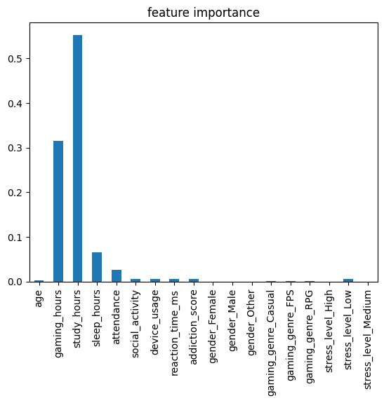
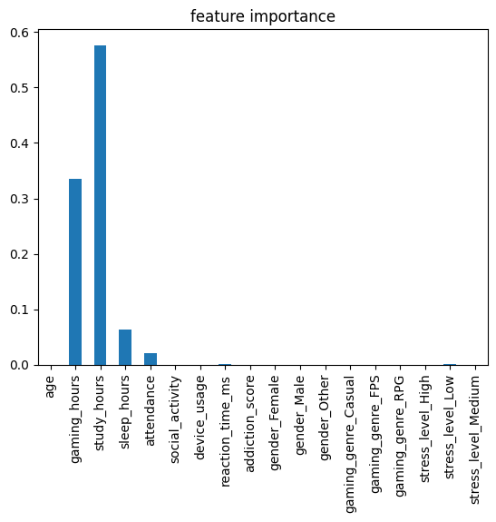
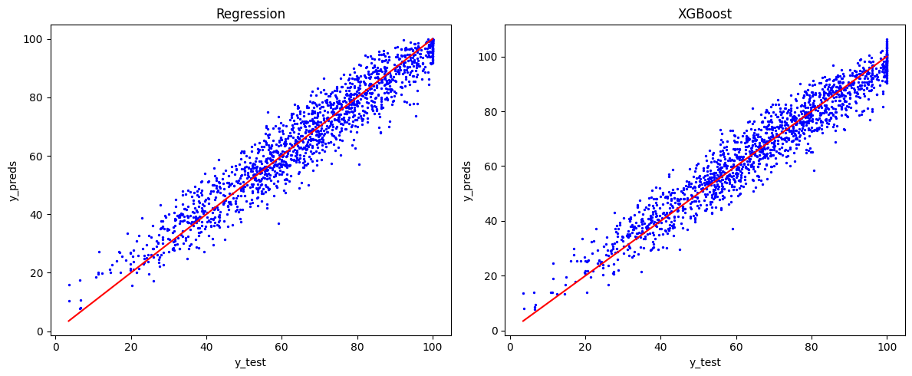

# Gaming & Academic Performance Predictor

Predicting student academic performance based on gaming habits and study patterns using machine learning.

## Dataset

- **Source:** [Gaming Academic Performance Dataset](https://www.kaggle.com/datasets/aiexplorer77/gaming-vs-academic-performance) (Kaggle)
- **Size:** 8,000 students, 13 features
- **Target:** `grades` (0–100)
- **Preprocessing:** Removed 134 records with grades > 100 (synthetic noise, 1.67% of data)

## Models

### RandomForestRegressor:
- **r2: 0.9227237278348802**
- **mae: 4.734954633752081**
- **mse: 35.94089808221223**
#### Checking on overfitting
- `reg.score(X_train, y_train)`: **0.9902128871554915**
- `reg.score(X_test, y_test)`: **0.9227237278348802**

### GradientBoostingRegressor:
- **r2: 0.9286484072487101**
- **mae: 4.571118427286819**
- **mse: 33.18535238860987**
#### Checking on overfitting
- `xgb.score(X_train, y_train)`: **0.9454885920266652**
- `xgb.score(X_test, y_test))`: **0.9286484072487101**


Both models show strong performance with minimal overfitting. Gradient Boosting is slightly preferred due to a lower overfitting gap (0.02 vs 0.07).

## Feature Importance

- ### For RandomForestRegressor:
  


- ### For GradientBoostingRegressor:
  


`study_hours` and `gaming_hours` together account for **~90% of feature importance**, which reflects the synthetic nature of the dataset. In real-world data, this dominance would likely be less extreme.

## Graphs Comparison



## Usage

**1. Run the notebook**

Open `Gaming_Academic_Performance.ipynb` in Jupyter or Google Colab.

**2. Generate a prediction**

At the end of the notebook, select a model and enter student data:
```
select model (RandomForestRegressor/GradientBoostingRegressor): xgb
your data:

study_hours: 5
gaming_hours (per day): 2
sleep_hours: 7
attendance (%): 85

prediction:  [82.62730464]
```

## Requirements

```
pandas
numpy
scikit-learn
matplotlib
```

## What I Learned

- How to detect and handle **skewed target distributions**
- Difference between **evaluation metrics** (R², MAE) and **evaluation strategy** (cross-validation)
- How to properly fill missing values for **numeric vs dummy columns** separately
- Importance of **critical analysis** of model predictions against real-world logic
